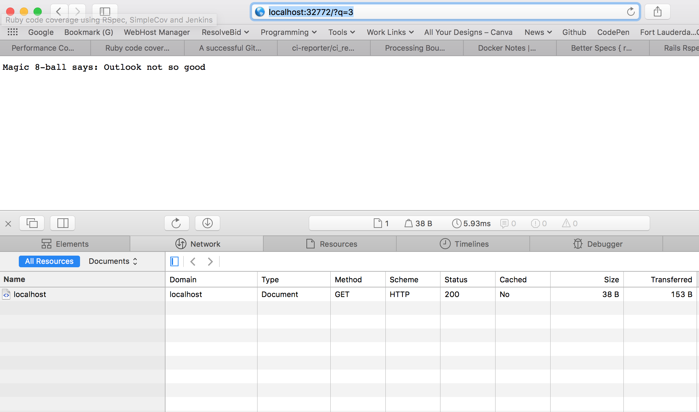
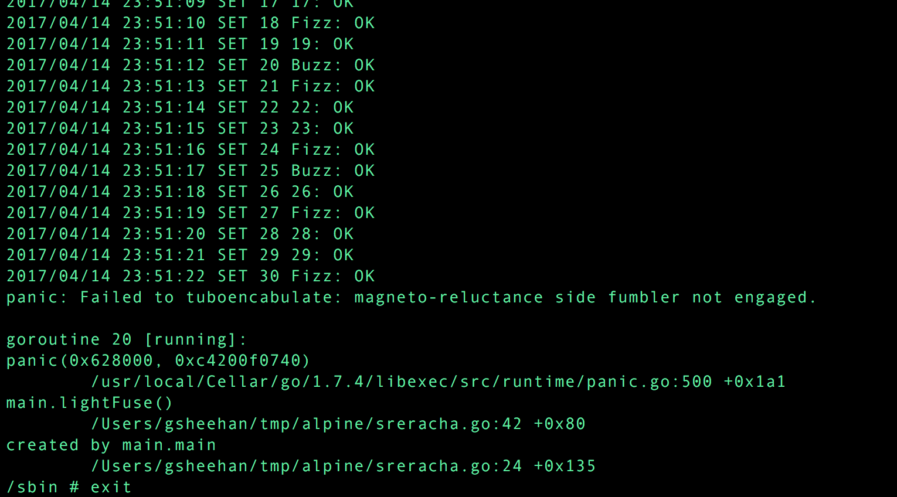

# Docker Project
Dockerfile code is [here](Dockerfile). Note that I had to change the Dockerfile to add Redis, set the proper file permissions, set the REDIS_URL environment variable, and I added a script to run Redis and the sreracha Go app. To run, ensure you have Docker installed, clone the repo, then follow these steps:

Build the image:
```bash
docker build -t sre-docker .
```

Run the image with port binding to host:
```bash
docker run -td -P sre-docker
```

To connect to the running container:
```bash
docker ps # Get the container id and assigned port
docker exec -it <container_id> sh
```

After issuing the `docker ps` command, get the assigned port that binds to port 80 and use your browser to go to `localhost:<port_number>`

Here is the result after going to the page, providing the required query string, and getting back a 200 OK response.



For Fizz Buzz, the developer is properly checking if the number is divisible by 3 (returning Fizz) and divisible by 5 (returning Buzz) but he didn't include any logic to check first if the number that is divisible by 3 is also divisible by 5 because in that case he should be returning FizzBuzz. Here is the screen capture of the FizzBuzz implementation as well as the output of the app crashing when it reaches 30.



The reason the app crashes can probably be pinpointed to the event where it has reached the count of 30 (at which point there should be a second FizzBuzz event). Also, the error given by the panic event gives the reason; the turboencabulator's fumbler has failed to engage. I would check the main winding of the second differential lambda for corrupt sinosoidal flux events. Second option is to pipe the grid-locked template to an non-compressed method.

As far as strategy for deployment, I would have a preference for using Amazon ECS. We could set up a multi-zone cluster for high availability. In the cluster, we could predefine the number of tasks or use an ELB with service auto-scaling to allow it to scale with traffic.
